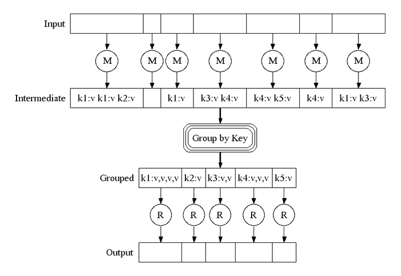

## 맵리듀스, 빅데이터의 솔루션들의 근간
 - 구글의 논문에서 처음 제안된 빅데이터용 클러스터 컴퓨팅에 사용되는 모델
   (여러 컴퓨터에 자동으로 분할하고 지역 처리 및 클러스터 노드 간 통신을 하기 위해 사용)
 - Split-Apply-Combine Strategy 의 한 형태(SQL의 GroupBy, R의 plyr 등에도 적용된 개념)
 - 혼자서 처리하기엔 큰 작업을 나눠서 처리하는 작업
 - map() : 'split' 된 data를 가져가 처리('apply')를 하는 역할
 - reduce() : map()의 결과물을 어떤 기준에 따라 다시 combine 하는 역할

## map() 과 reduce()
1) map
  - in_key와 in_value를 입력받아 out_key와 intermediate_value의 list를 반환
  - in_key : split의 결과로 생긴 partitioining 키 값(최종 output에는 반영되지 않음)
  - out_key : map함수가 결과물을 구분하는 기준 키 값(ex. 0: 'A', 1: 'B' 를 길이 2의 list로 반환)
2) reduce
  - intermediate_value 들을 out_key 별로 구분하여 리스트업한 것을 입력받아
    out_key 를 기준으로 sum 한 것을 out_value의 list로 반환
  - 각 list 별로 키 값에 따라 group by된 것을 합쳐서 다시 키 값에 따라 group by 
> 

3) 초기의 Mapreduce의 약점 
  - reduce는 모든 map 함수가 중간 결과물(intermediate_value)을 리턴하여 grouping된 결과가 나올 때 까지 대기
  - 이를 위해 map 함수와 같이 reduce 함수 또한 여러 개를 병렬수행 가능

## 병렬/분산/클러스터 컴퓨팅
 - 병렬 : 한 대의 컴퓨터 안에서 CPU코어를 여러 개 사용하여 성능을 향상 시키는것(멀티 프로세스, 멀티 쓰레드)
 - 분산 : 여러 대의 컴퓨터가 네트워크로 연결된 상황을 전제(P2P, Http)
 - 클러스터 : 여러 대의 컴퓨터들이 연결되어 하나의 시스템처럼 동작하는 컴퓨터들의 집합(노드, 관리자로 구성)
                 (병렬, 분산, 클라우드 등을 포함한 개념)

## 파이썬 기본함수(map, filter, reduce)와 mapreduce
  - 함수를 데이터컬렉션에 적용하는 함수들
  - map: 모든 요소에 적용/ filter: 조건에 맞는 요소만 필터링/ reduce: 콜렉션을 축약

## 빅데이터 스택
 - 큐잉 시스템 (Queuing system) - 카프카(Kafka), 래빗MQ(RabbitMQ), 키네시스(Kinesis)
 - 스트림 처리 - 스톰(Storm), 스파크 스트리밍(Spark Streaming), 삼자(Samza)
 - 고속 스토리지 -  몽고DB(MongoDB), 카산드라(Cassandra), HBase

## 실시간 데이터(스트리밍) 처리 방식
1) 한정 데이터(Bounded data) 처리 :  이미 저장된 데이터를 처리하는 것, 별도의 처리 패턴 없음
2) 무제한 데이터(Unbounded data) : 스트리밍 데이터로 배치(batch)와 스트리밍(streaming)의 두가지 패턴으로 처리한다.
- Batch : 스트리밍 데이터를 일정 시간 단위로 모아 처리하는 방식. 구현이 간단하나 데이터 수집 후 처리가 되므로 실시간 처리에서 떨어진다.
- Streaming : 스트리밍 처리에는 Time agnostic, Filtering, Inner join, Windowing 방식 등이 있고, 배치에 비해 복잡하다. Skew가 환경에 따른 변화가 심해 데이터가 시스템에 도착하는 순서 역시 순차적이지 않기 때문이다.
  * Time agnostic : 시간 속성이 없는 데이터로 들어오는 순서대로 처리한다.
  * Filtering : 들어오는 데이터 중 특정 데이터만 필터링 후, 저장한다.
  * Inner join : 교집합이라는 말처럼, 두개의 무제한 데이터에서 들어오는 값을 비교, 매칭시켜 값을 구별한다.
  * Windowing : 스트리밍 데이터를 일정한 시간 간격으로 처리한다. 
3) 람다 아키텍처 -> 일괄처리를 통해 빅데이터 아키텍처를 간소화