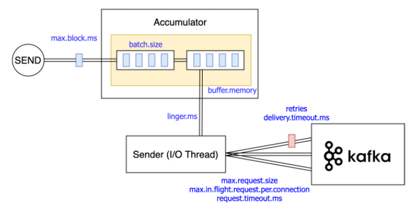

## 카프카 시스템의 목표

1. 메시지 프로듀서와 컨슈머 사이의 느슨한 연결
2. 다양한 형태의 데이터 사용 시나리오와 장애 처리 지원을 위한 메시지 데이터 유지
3. 빠른 처리 시간을 지원하는 구성 요소로 시스템의 전반적인 처리량을 최대화
4. 이진 데이터 형식을 사용해서 다양한 데이터 형식과 유형을 관리
5. 기존의 클러스터 구성에 영향을 주지 않고 일정한 서버의 확장성을 지원

## Producer(accumulator + sender)
> 
1. 파라미터
- 카프카 서버 성능에 크게 영향을 미치는 요인은 acks, retries, batch.size
- `acks=all`
  - `acks` : __broker가 producer에게 메세지를 수신했음을 나타내는 신호__
  - `min.insync.replicas=n` in broker
  - 위 설정은 `acks=all`로 했을 경우 리더를 포함한 인스턴스 n개의 승인(데이터복제,저장)을 받으면 바로 프로듀서에게 결과를 전달
  - 장애가 발생했을 때 카프카 클러스터에 영향없이 서비스를 지속하려면 모든 파티션에서 ISR에 속하는 복제본의 수가 해당 설정 이상이어야함
  - 최적은 `acks=all, min.insync.replicas=2, replication factor=3` 라고 카프카문서에 명시
- `retries` : 전송실패 시, 자동으로 재전송하는 회수 (default = 0)
  - 일반적으로 이보다 `delivery.timeout.ms`로 재발송을 제어
  - `delivery.timeout.ms` : broker로 부터 acks 를 받기위해 대기하는 시간의 상한, 실패시 재전송에 허용된 시간<br>
      (request.timeout.ms + linger.ms 보다 같거나 커야 함)
  - `request.timeout.ms` : 요청응답에 대한 최대 대기 시간. 이 시간동안 응답을 못 받으면 재요청
- `max.in.flight.requests.per.connection` (__default = 5__)
  - 한 번에 broker와 통신하는 request 수
  - 1보다 크게 설정 후 retries를 사용할 시, 2개의 배치가 하나의 파티션으로 들어갈 때 순서가 달라질 수 있음(배치1 실패 -> 배치2 성공 -> 배치1 retries)
- `batch.size` : producer의 buffer에서 broker에게 데이터를 전송할 때 보낼 batch의 크기. 작을 수록 처리량이 떨어지는 경향(꼭 맞을 때까지 대기하는건 아님)
- `linger.ms`
  - 효율적인 배치 전송을 위해 acuumulator의 데이터를 느리게 가져오며 전송을 지연시키는 시간(latency는 감수)
  - 아직 채워지지 않은 배치의 크기를 최대화하고, 빈번한 요청을 줄이는 이점(5 정도로 설정하면 전송 효율)
  - 해당 시간이 되지 않았더라도 batch.size를 만족했다면 이르 무시하고 바로 전송
- `buffer.memory` : producer의 buffer 크기(producer의 accumulator가 sender에게 보내기전 보관하는 공간)
  - buffer가 가득찼을 때 max_block_ms 만큼 send, partitionsFor 를 block 시킴
- `compression.type`
  - 데이터 전송 시 이를 압축하여 보내는 방법(‘gzip’, ‘snappy’, ‘lz4’, or None)
  - GZIP 이 snappy, LZO 에 비해 cpu 사용량이 많지만 높은 압축률. 접근이 자주 안되는 데이터에 유리
- `partitoner` : 메시지를 전송할 때 어떤 파티션으로 전해줄지 결정하는 알고리즘 설정
  
2. producing 방식
- 특정 토픽의 파티션으로 메시지를 송신할 때, 버퍼처럼 프로듀서의 메모리를 이용하여 일정량 축적 후 송신
  - `batch.size` 만큼 축적
  - `linger.ms` 만큼 대기
  - 둘 중 하나에 도달하는 것을 트리거로 하여 전송
- 메시지 전송 파티셔닝
  - Key의 해시값을 사용한 송신
    - `Key`와 `Value`로 이루어진 메시지의 `Key` 를 이용하여 전송할 파티션을 결정
    - 동일한 Key를 가진 메시지는 동일한 ID를 가진 파티션으로 전송
    - partitionkey 를 이용하면 메시지 순서 보장이 되지만, 파티션 간의 균형을 신경써야 함

    
## Broker
1. 파라미터
- `message.max.bytes=1000000`
  : 서버가 받을 수 있는 메세지의 최대 크기, __컨슈머의 `fetch.message.max.bytes`와 값을 맞추는게 중요.__ 예상치 않은 큰 메세지를 보내는 것을 방지 하기위해 값을 조절하기도 하지만, 기본값(1MB)보다 큰 길이의 메세지를 처리하려면 조절
- `num.network.threads=3`
  : 네트워크 요청을 처리하는 쓰레드 수, NIO Selector (java.nio.channels.Selector)개수
- `num.io.threads=8` 
  : I/O가 생길 때마다 spawn되는 쓰레드 수, __로그 저장에 사용되는 디스크 수와 동이하게 지정하기를 권장__
- `background.threads=10`
  : 여러가지 백그라운드 작업(오래된 로그 삭제 등)을 하는 쓰레드의 수.
- `queued.max.requests=500`
  : I/O 쓰레드가 처리하는 동안 지연된 메세지를 보관하는 큐의 크기, __큐가 가득차면 네트워크 쓰레드는 더 이상 메세지를 받지 않음__
- `socket.send.buffer.bytes=102400`
  : 소켓 커넥션에 사용될 SO_SNDBUF 버퍼 크기, 소켓을 생성하여 send buffer와 receive buffer가 각각 할당될 때 send buffer에 대한 설정. 커널이 참조만 할 뿐, 커널에서 자동 조절함
- `socket.receive.buffer.bytes=102400`
  : 소켓 커넥션에 사용될 SO_RCVBUFF 버퍼 크기
- `socket.request.max.bytes=104857600`
  : 서버가 받을 수 있는 최대 요청 개수, 서버 메모리의 고갈을 방지 자바 힙크기 보다 작게 설정
- `num.partitions=1`
  : 토픽당 로그 파티션의 기본 개수
- `min.insync.replicas`
  : 프로듀서가 acks=all로 설정하여 메시지를 보낼 때, write를 성공하기 위한 최소 복제본의 수. Replication Factor 수에 따라 프로듀서의 메시지가 성공 또는 실패가 결정
- `num.replica.fetchers`, `auto.create.topics.enable`, `log.flush.interval.messages`, `log.flush.interval.ms` 등

## Consumer
1. 파라미터
  - `fetch.min.bytes` : 한 번에 가져올 수 있는 데이터의 최소 크기, 해당 크기가 되기까지 대기함(max도 있음)
  - `fetch.max.wait.ms` : `fetch.min.bytes` 에 의해 대기하는 시간의 상한선.
  - `auto.commit.enable`
    - 주기적으로 오프셋을 커밋할 지 여부
    - `auto.commit.interval.ms` 을 통해 주기 설정
  - `session.timeout.ms`
    - consumer 의 세션유지를 판단하는 시간. 초과하면 장애로 판단 후 리밸런스 시도
    - 짧으면 GC, poll loop 완료시간이 길어지게 되어 리밸런스가 일어나기도 함
    - 길면 리밸런스보다 실제 오류 탐색 로드가 커짐
  - `heartbeat.interval.ms`
    - 그룹 코디네이터에게 얼마나 자주 poll 로 heart-beat를 보낼지 설정
    - `session.timeout.ms` 값보다 반드시 작아야하며 보통 1/3 정도로 설정
  - `max.poll.interval.ms`
    - consumer 가 heart-beat 만 보내고 메시지를 가져가지 않는 '무기한 파티션 점유' 를 방지
    - poll 을 호출하지 않으면 장애로 판단하여 다른 consumer 에게 파티션을 넘겨 줌
2. consumer group 
   - 가용성
      - consumer가 하나로 이루어지면 장애가 발생했을 때 작업이 중단됨
      - 따라서 다수의 consumer로 `consumer group`을 이루어 하나의 consumer에 장애가 생겼을 때 같은 group내의 다른 consumer가 작업을 이어나가 안정성을 확보
   - group 별 offset 관리
      - group없이 다수의 consumer가 따로 존재한다면 kafka에서는 각각의 consumer를 구별하지 못하여 데이터(같은 topic의 같은 partition)의 `offset`이 따로 관리되지 못함
      - 따라서 consumer들이 필요한 데이터를 정확히 가져갈 수 없게 되므로 `consumer group`마다 name으로 구분하여 `offset`을 따로 관리함
      - group id가 같은 경우 `offset`을 공유하여 소비하지만, 다른 경우엔 처음부터 재조정됨(0부터 데이터를 다시 소비)
      - 즉, 다른 consumer에 의해 Task가 실행되어도 실제 삭제가 되지는 않음
   - consumer group과 partition의 관계
      - 하나의 partition에 대해 `consumer group` 내 하나의 consumer만 접근 가능
      - 따라서 partition의 수보다 consumer의 수가 많으면 대기상태의 잉여 consumer가 생김
      - 하나의 consumer가 두 개의 partition에서 가져온다던가 대기상태에 놓인다면 비효율적 

3. offset commit
  - 다음 수신(및 처리)해야 할 메세지의 오프셋 기록
    - 컨슈머 그룹마다 각 토픽의 파티션에서 어느 지점까지 수신했는지 기록
    - 처리 완료한 여부를 __메시지마다가 아닌__ 처리를 완료한 메세지 중 `최대의 offset` 을 기록
    - 메시지가 처리되지 않을 경우 무한 루프가 생길 수 있어 이를 `__consumer_offsets` 라는 전용 토픽에 기록
  - commit 방식
    - auto offset commit
      ```
      enable.auto.commit=true
      auto.commit.interval.ms=5000 # offset commit 간격 설정 default: 5초
      장점 : offset commit 을 명시적으로 할 필요 없음
      단점 : 컨슈머 장애가 발생했을 때, 메시지 손실/중복이 발생할 수 있음
      ```
    - manual offset commit : 지원하는 메서드를 통해 수동으로 commit 할 수 있음
      ```
      enable.auto.commit=false
      장점 : 해당 메시지는 반드시 완료된 것이기 때문에 손실 없음(컨슈머 장애 시 중복도 최소화)
      단점 : 메시지양에 따라 다르지만 수동으로 commit이 자주 일어나므로 카프카 클러스터의 부하 발생
      ```
  
## Topic & Partition
0. Topic 과 Partition 단위는 Kafka 가 메시지를 전달하는 데 병렬적으로 처리할 수 있는 단위
1. 메세지는 `Topic`으로 분류되고, `Topic`은 여러개의 `Partition`으로 구성됨(partition 내의 한 칸은 log)
2. 데이터는 한 칸의 로그에 순차적으로 추가되고, 메세지의 상대적인 위치를 나타내는 것이 `offset`
3. `Parition`을 추가하게 되면 라운드 로빈 방식으로 Task가 추가 됨
4. partitioner 의 종류
  - Range Assignor
    - consumer member_id 를 사전식으로 정렬 후 partition 을 Numeric 순으로 할당
    - topic 의 parition 수만큼 consumer 필요
    - consumer 보다 topic partion 수가 적은 경우, 뒤쪽의 consumer 들은 대기상태
  - Round Robin Assignor
    - 전체 consumer 에 대해 topic/partition 을 순차적으로 분배
    - range assignor 에 비해 consumer 를 더욱 활용하나, consumer 가 하나 종료될 경우 서로 다른 broker 의 동일 topic 의 partition 이 한 consumer 에게 몰리는 경우 발생
  - Sticky Round Robin Assignor
    - Round Robin 과 기본적으로 동일하지만 consumer 종료시 partition 의 이동을 최소화 함
    - Round Robin 의 경우 모든 partition 의 재배치
   ```
   Q) partition 가 많으면 무조건 좋다?
    - topic이 생성된 이후로는 partition을 늘릴 수는 있지만 줄이는 것은 안 됨. 또한 key 와 같이 사용한다면 파티션의 수가 달라져 항상 같은 파티션으로 전달된다는 보장 x
    - 파티션은 파일시스템 상 인덱싱파일, 실제데이터파일 쌍이 속한 디렉토리로 매핑. 파티션이 늘어날수록 파일 descriptor, handler 부담이 큼 (보통 broker당 3만개)
    - leader -> follower 간의 복제, 전환의 load가 늘어남
    - end-to-end(producer to consumer) latency 
    - 테스트를 통해 어느 정도의 consumer의 수를 유지했을 때, 데이터를 가져올 때 밀리는 증상이 없는지 확인 후, 해당 수만큼 파티션 수를 구성하는 것이 효율적

   ```

## Skew
1. 한 topic 내의 partition 들이 각 브로커 서버에 균등하게 나눠지지 않고, 한 쪽으로 치우친 현상
2. 각 Partition들은 레플리케이션에 의해 `Leader / Follower`로 나뉘고, Leader Partition에 해당하는 Skew를 `Leader Skew`
