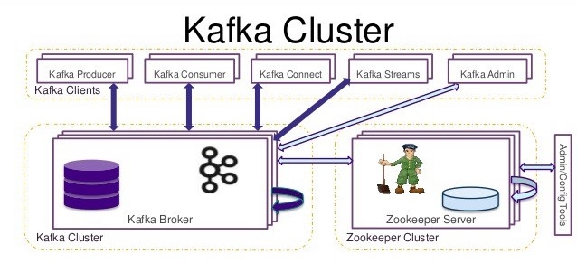

# zookeeper/kafka server의 관계
- zookeeper는 본래 하둡(Hadoop)의 서브 프로그램 중 하나로, 대용량 분산 처리 애플리케이션인 하둡은 
  중앙에서 분산 애플리케이션을 관리하는 코디네이션 애플리케이션이 필요했기에 서브 프로젝트로서 zookeeper 개발 작업을 진행하고 있었음.
- 2011년 1월에 이르러 주키퍼는 드디어 하둡의 서브 프로젝트에서 벗어나 아파치의 탑 레벨 프로젝트로 승격되었고, 
  현재는 아파치 카프카뿐만 아니라 스톰, 에이치 베이스, 나이파이 프로젝트 등 많은 애플리케이션에서 사용되고 있음. 

> 

# zookeeper/kafka server의 운영방식
- 분산 어플리케이션이라는 면에서 보면 주키퍼와 동일하지만, kafka 클러스터가 운영되는 방식은 다름
- zookeeper는 과반수 방식으로 운영되어 홀수로 서버를 구성해야 하지만 kafka는 홀수 운영 구성을 하지 않아도 됨
- 소규모 프로젝트에서는 kafka와 주키퍼를 동일한 서버 3대에 같이 올려 운영 가능하지만 대규모 환경에서는 비추천 
- kafka는 클러스터를 3대로 구성했을 때 2대가 다운되어도 서비스를 할 수 있는 반면, zookeeper는 앙상블을 3대로 구성했을 때 2대가 다운되면 과반수에 미치지 못하기 때문에 장애 발생
- 이와 같은 장애 상황에서 kafka가 정상작동하더라도 zookeeper가 kafka와 통신을 못한다면 kafka도 장애 상황에 놓이게 되므로 서로 다른 서버에 두기를 권장
- (참고링크) <kafka 등장 배경 및 특징> 
  
  https://www.hanbit.co.kr/channel/category/category_view.html?cms_code=CMS9400468504 


# Kafka data structures in Zookeeper

>  

##1. Topic registration info:
/brokers/topics/[topic] :
```
Schema:
{ "fields" :
    [ {"name": "version", "type": "int", "doc": "version id"},
      {"name": "partitions",
       "type": {"type": "map",
                "values": {"type": "array", "items": "int", "doc": "a list of replica ids"},
                "doc": "a map from partition id to replica list"},
      }
    ]
}

Example:
{
  "version": 1,
  "partitions": {"0": [0, 1, 3] } }
}
```
##2. Partition state info:
/brokers/topics/[topic]/partitions/[partitionId]/state
```
Schema:
{ "fields":
    [ {"name": "version", "type": "int", "doc": "version id"},
      {"name": "isr",
       "type": {"type": "array",
                "items": "int",
                "doc": "an array of the id of replicas in isr"}
      },
      {"name": "leader", "type": "int", "doc": "id of the leader replica"},
      {"name": "controller_epoch", "type": "int", "doc": "epoch of the controller that last updated the leader and isr info"},
      {"name": "leader_epoch", "type": "int", "doc": "epoch of the leader"}
    ]
}
 
Example:
{
  "version": 1,
  "isr": [0,1],
  "leader": 0,
  "controller_epoch": 1,
  "leader_epoch": 0
}
```
##3. Broker registration info:
/brokers/ids/[brokerId]
```
Schema:
{ "fields":
    [ {"name": "version", "type": "int", "doc": "version id"},
      {"name": "host", "type": "string", "doc": "ip address or host name of the broker"},
      {"name": "port", "type": "int", "doc": "port of the broker"},
      {"name": "jmx_port", "type": "int", "doc": "port for jmx"}
    ]
}
 
Example:
{
  "version": 1,
  "host": "192.168.1.148",
  "port": 9092,
  "jmx_port": 9999
}
```
##4. Controller epoch: 

/controller_epoch
```
-> int (epoch)
```
##5. Controller registration:

/controller
```
-> int (broker id of the controller)
```
##6. Consumer registration:
/consumers/[groupId]/ids/[consumerId]
```
Schema:
{ "fields":
    [ {"name": "version", "type": "int", "doc": "version id"},
      {"name": "pattern", "type": "string", "doc": "can be of static, white_list or black_list"},
      {"name": "subscription", "type" : {"type": "map", "values": {"type": "int"},
                                         "doc": "a map from a topic or a wildcard pattern to the number of streams"}      }    ]
}
 
Example:
A static subscription:
{
  "version": 1,
  "pattern": "static",
  "subscription": {"topic1": 1, "topic2": 2}
}
 
 
A whitelist subscription:
{
  "version": 1,
  "pattern": "white_list",
  "subscription": {"abc": 1}}
 
A blacklist subscription:
{
  "version": 1,
  "pattern": "black_list",
  "subscription": {"abc": 1}}
```
##7. Consumer owner:

/consumers/[groupId]/owners/[topic]/[partitionId]
```
-> string (consumerId)
```
##8. Consumer offset:

/consumers/[groupId]/offsets/[topic]/[partitionId] 
```
-> long (offset)
```
##9. Re-assign partitions

/admin/reassign_partitions
```
{
   "fields":[
      {
         "name":"version",
         "type":"int",
         "doc":"version id"
      },
      {
         "name":"partitions",
         "type":{
            "type":"array",
            "items":{
               "fields":[
                  {
                     "name":"topic",
                     "type":"string",
                     "doc":"topic of the partition to be reassigned"
                  },
                  {
                     "name":"partition",
                     "type":"int",
                     "doc":"the partition to be reassigned"
                  },
                  {
                     "name":"replicas",
                     "type":"array",
                     "items":"int",
                     "doc":"a list of replica ids"
                  }
               ],
            }
            "doc":"an array of partitions to be reassigned to new replicas"
         }
      }
   ]
}
 
Example:
{
  "version": 1,
  "partitions":
     [
        {
            "topic": "Foo",
            "partition": 1,
            "replicas": [0, 1, 3]
        }
     ]            
}
```
10. Preferred replication election

/admin/preferred_replica_election
```
{
   "fields":[
      {
         "name":"version",
         "type":"int",
         "doc":"version id"
      },
      {
         "name":"partitions",
         "type":{
            "type":"array",
            "items":{
               "fields":[
                  {
                     "name":"topic",
                     "type":"string",
                     "doc":"topic of the partition for which preferred replica election should be triggered"
                  },
                  {
                     "name":"partition",
                     "type":"int",
                     "doc":"the partition for which preferred replica election should be triggered"
                  }
               ],
            }
            "doc":"an array of partitions for which preferred replica election should be triggered"
         }
      }
   ]
}
 
Example:
 
{
  "version": 1,
  "partitions":
     [
        {
            "topic": "Foo",
            "partition": 1         
        },
        {
            "topic": "Bar",
            "partition": 0         
        }
     ]            
}
```
##11. Delete topics
/admin/delete_topics/[topic_to_be_deleted] (the value of the path in empty)
```
0.8.1
Topic Configuration

/config/topics/[topic_name]

Example

{
  "version": 1,
  "config": {
    "config.a": "x",
    "config.b": "y",
    ...
  }
}
/config/changes/[config_change_x] -> "topic_name"

Contains the name of the topic that changed.

0.9.0
Client and Topic configuration overrides: The content of both znodes has the same structure
/config/clients/[topic_name]

/config/topics/[topic_name]

{
  "version": 1,
  "config": {
    "config.a": "x",
    "config.b": "y",
    ...
  }
}
Config Change notification (Topic and Client config)
{"version" : 1, "entity_type":"topics/clients", "entity_name" : "topic_name/client_id"}
ISR Change notification
/isr_change_notification/isr_change_x

Gets created when ISR is changed at any broker, controller watches for these notifications and sends MetadataUpdateRequest to all brokers.

Broker registration info
/brokers/ids/[brokerId]

Schema:
{ "fields":
    [ {"name": "version", "type": "int", "doc": "version id"},
      {"name": "host", "type": "string", "doc": "ip address or host name of the broker"},
      {"name": "port", "type": "int", "doc": "port of the broker"},
      {"name": "jmx_port", "type": "int", "doc": "port for jmx"}
      {"name": "endpoints", "type": "array", "items": "string", "doc": "endpoints supported by the broker"}
    ]
}
 
Example:
{
  "version":2,
  "host","localhost",
  "port",9092
  "jmx_port":9999,
  "timestamp":"2233345666",
  "endpoints": ["PLAINTEXT://host1:9092", "SSL://host1:9093"]
}
ACL info. The content of these znodes have the same structure
/kafka-acl/Topic/[topic_name]

/kafka-acl/Cluster/kafka-cluster

/kafka-acl/Group/[groupId]

{"version": 1, "acls": [ { "host":"host1", "permissionType": "Allow","operation": "Read","principal": "User:alice"}]}
0.10
Broker registration info
/brokers/ids/[brokerId]

Schema:
{ "fields":
    [ {"name": "version", "type": "int", "doc": "version id"},
      {"name": "host", "type": "string", "doc": "ip address or host name of the broker"},
      {"name": "port", "type": "int", "doc": "port of the broker"},
      {"name": "jmx_port", "type": "int", "doc": "port for jmx"}
      {"name": "endpoints", "type": "array", "items": "string", "doc": "endpoints supported by the broker"}
      {"name": "rack", "type": "string", "doc": "Rack of the broker. Optional. This will be used in rack aware replication assignment for fault tolerance."}
    ]
}
 
Example:
{
  "version":3,
  "host":"localhost",
  "port":9092,
  "jmx_port":9999,
  "timestamp":"2233345666",
  "endpoints": ["PLAINTEXT://host1:9092", "SSL://host1:9093"],
  "rack": "us-east-1c"
}
```